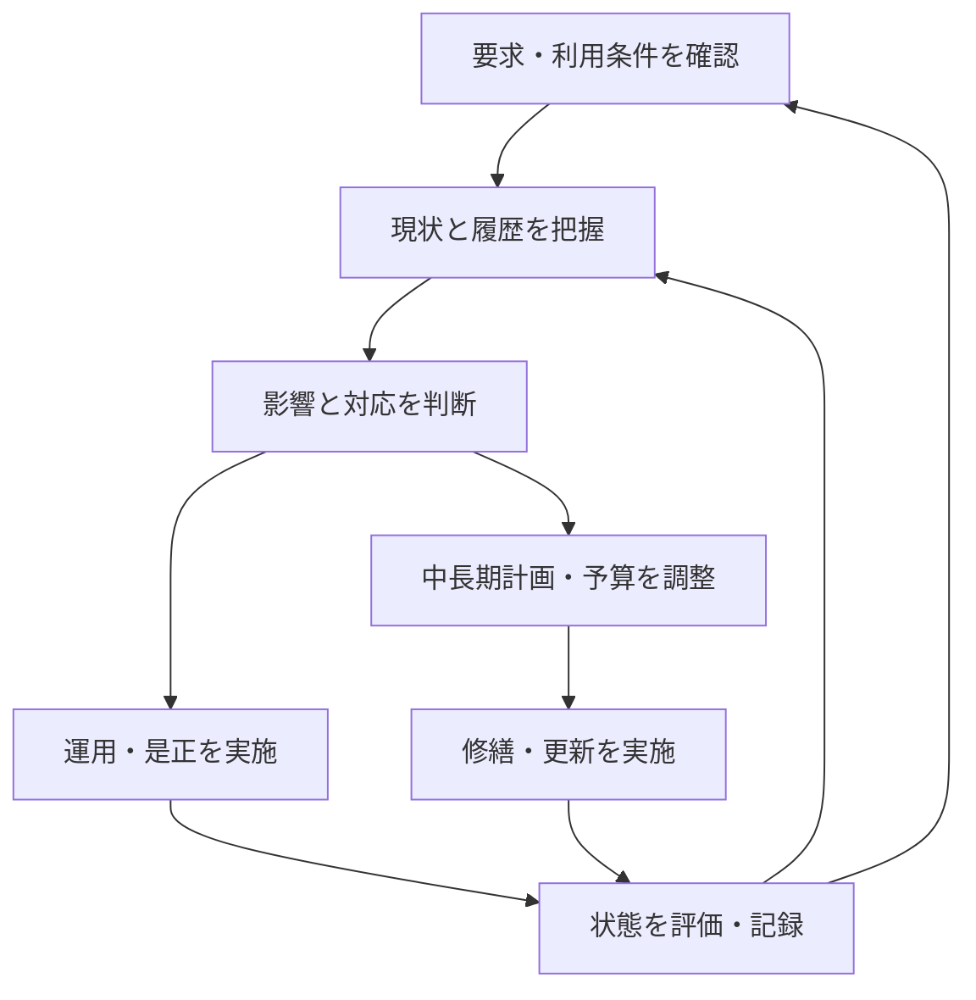

# 活動のつながりと時間軸

## 目的

[BUSINESS-001](overview.md) に挙げた目的を、日常の活動と中長期の判断につなげます。以下は [S1](sources.md#s1)、[S3](sources.md#s3)、[S4](sources.md#s4)、[S7](sources.md#s7) を踏まえた概念整理です。個別業務の標準手順を確定するものではありません。

## 活動の循環

緊急時は、長期計画の確定を待たず、権限と安全を確認して応急対応や使用制限へ進む想定です。詳しい判断条件・連絡順序は後続 Process で定義します。

| 段階 | 主な入力 | 判断・活動 | 次へ渡すもの |
| --- | --- | --- | --- |
| 要求・条件の確認 | 法令等の適用条件、利用目的、管理範囲 | 必要な状態と役割を確認する | 要求事項、対象範囲、確認すべき条件 |
| 状態把握 | 点検・測定結果、異常通報、過去の図書・履歴 | 不具合と要求との差を把握する | 状態、根拠、未確認の箇所 |
| 対応判断 | 問題の影響、技術的選択肢、利用条件 | 当面の措置と計画的対策を分ける | 対応方針、判断者、残るリスク |
| 実施 | 承認した内容、必要な資金・作業条件 | 運用調整、清掃、修理、修繕・更新等 | 実施内容、測定・確認結果 |
| 評価・記録 | 実施後の状態、費用、利用への影響 | 要求との対応と残課題を確かめる | 完了判断、履歴、次の調査・計画変更 |

## 日常運用と中長期保全

官庁施設向け資料では、中長期保全計画と年度保全計画、点検結果・修繕履歴を扱っています。[S3](sources.md#s3) 本整理では、これを以下の時間軸を接続する手がかりとします。

- **日常・短期**：現在の状態を把握し、必要な運用・対策を実施する。
- **年度**：実施する作業、時期、予算、利用調整を具体化する。
- **中長期**：修繕・更新の見通しと資金の準備を行う。

各時間軸は別々に固定しません。劣化や利用条件の変化を踏まえて計画を見直し、計画に基づく実施結果を履歴へ戻す整理です。マンションのガイドラインでも、長期修繕計画は将来の工事内容・時期・費用を確定するものではなく、見直しを前提としています。[S4](sources.md#s4)

## 読み取り例

以下は理解用に作成した架空例で、現場 Evidence ではありません。

「雨漏りを確認した」場合、利用への影響を把握して当面の措置を行い、原因調査へつなげます。局部的な修理で足りるか、防水等の計画修繕を見直すかを検討し、実施後の状態を確認して履歴に残します。

ここでの成果は「工事を発注した」ことだけでなく、「問題がどこまで解消し、何が残っているかを判断できる」ことです。原因、工法、費用、判断権限は実物件で確認が必要です。

## 情報源と関連文書

- [BUSINESS-004](sources.md)：S1、S3、S4、S7の確認内容。
- [BUSINESS-002](actors.md)：活動ごとの関係主体・役割。
- [BUSINESS-001](overview.md)：各活動が目指す状態。

## 未確認事項

- 緊急性・重要度を評価する具体的な基準と承認権限。
- 運用調整・修理・更新の比較方法、停止損失を含む経済性の評価方法。
- 業務領域間の入出力と例外。後続 Issue で個別の Process と接続する。
