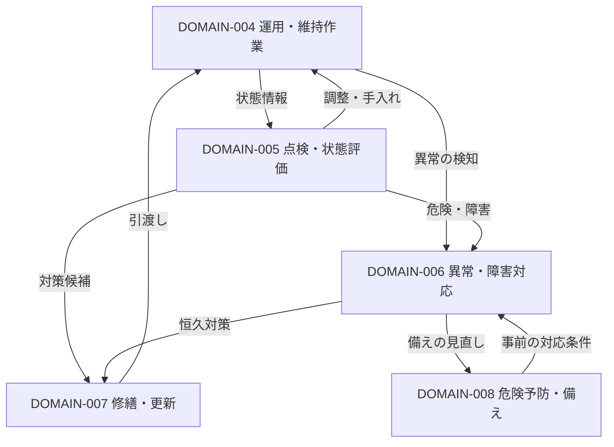

# 業務領域一覧

建物維持保全を成立させる機能を、9つの領域で俯瞰する初期マップ。[BUSINESS-001：建物維持保全の全体像](../00-business/overview.md)と同じく、日本の既存建物・敷地・設備の継続利用を対象とする。新築・売買・賃貸営業そのものは含めない。

**9領域の名称・分割・対応関係は、複数資料を比較した本知識ベースの整理案である。** 単一の法令・規格が定める分類ではなく、現場での実施実態でもない。資料で確認した内容は「情報源」に分けて記載した。個々の建物への義務・頻度・資格の適用は別途確認する。

## 分類案の比較と採用理由

| 分類の軸・参照体系 | 捉えやすいこと | そのまま主軸にした場合の不足 | 今回の扱い |
| --- | --- | --- | --- |
| 委託作業・対象の区分：国交省の共通仕様書（[D3](#d3)） | 日常・定期の実務と対象物 | 所有者側の要求・資金計画や更新判断を十分に表せない。作業の種類と対象も混在する | 作業の抜けを確認する補助軸に採用 |
| 衛生対象の区分：厚労省の管理基準（[D4](#d4)） | 空気・水・清掃・防除のまとまり | 衛生以外の保全を覆わず、測定・手入れ・改修が同じ対象に入る | 衛生分野の対象確認に採用 |
| 経営・管理の循環：JFMA（[D1](#d1)）、ISO公開概要（[D2](#d2)） | 要求から計画、実行、評価へのつながり | FMの範囲は維持保全より広く、公開概要だけでは作業粒度を決められない | 機能をつなぐ主軸として採用。既存建物の維持保全へ範囲を限定 |
| 維持保全計画の構成：告示の掲載資料（[D5](#d5)）、官庁施設資料（[D6](#d6)） | 体制、点検、修繕、資金、図書等の関係 | 計画の記載項目と、実行する業務領域は同一ではない | 計画・調整・記録の取りこぼし確認に採用 |
| 安全・衛生等の目的別：[BUSINESS-001](../00-business/overview.md) | 必要性と提供価値 | 点検や修繕が複数目的に寄与するため区分が重なる | 領域との多対多の対応に採用 |
| 所有者・PM・FM・BM・専門業者等の主体別 | 依頼・実施・承認の関与 | 自営・委託や契約変更で分類が変わり、業務の抜け・重なりを隠す | 領域の属性にする。主分類には採用しない |

結論として「何のために、どの判断・状態を成立させる機能か」で領域を分ける。機能ごとに実施主体・対象・周期・法定性を重ねる。PM・FM・BM等の呼称だけで、法的責任や契約上の担当を決めない。

## 業務領域とIssue2の目的との対応

目的は[BUSINESS-001](../00-business/overview.md)の7観点。以下は主な寄与であり、他の目的への寄与を排除しない。各リンク先に目的・問題・範囲・業務例・主体・関係・根拠・未確認事項を記載した。

| 領域 | 成立させること・主な範囲 | 主に支える目的 |
| --- | --- | --- |
| [DOMAIN-001：要求・適用条件の管理](requirements.md) | 適用条件と求められる状態を明らかにする | 法令等への適合、管理の継続性 |
| [DOMAIN-002：保全計画・資金計画](planning.md) | 対策・時期・優先度・資金を見通す | 資産保全、経済性・実行可能性 |
| [DOMAIN-003：業務実施体制・発注調整](delivery-coordination.md) | 役割・資源・依頼条件と履行確認を整える | 経済性・実行可能性、管理の継続性 |
| [DOMAIN-004：運用・維持作業](operations.md) | 運転・手入れ・清掃等で状態を保つ | 衛生・利用環境、機能継続、資産保全 |
| [DOMAIN-005：点検・測定・状態評価](inspection-assessment.md) | 状態と要求との差、対応要否を把握する | 人の安全、衛生・利用環境、機能継続、法令等への適合、資産保全 |
| [DOMAIN-006：異常・障害対応](incident-response.md) | 異常の影響を抑え、復旧へつなぐ | 人の安全、機能継続 |
| [DOMAIN-007：修繕・更新](repair-renewal.md) | 必要な性能を回復・確保して引き渡す | 資産保全、機能継続、人の安全 |
| [DOMAIN-008：危険予防・非常時の備え](risk-preparedness.md) | 危険を予防し、非常時に対応できる条件を保つ | 人の安全、機能継続 |
| [DOMAIN-009：記録・報告・保全評価](records-evaluation.md) | 情報を引き継ぎ、保全全体の結果を見直しへ返す | 管理の継続性、法令等への適合。評価では7目的全体を扱う |

## 主要業務への入口

[PROCESS-001：業務カタログ](../02-processes/overview.md)に22件を登録した。各Domain文書の「登録した主要業務」からも、主な成果・入出力・前後業務を辿れる。対象別の詳細手順や法令適用は引き続き確認する。

## 領域間のつながり

次図は、状態に対処する領域間の主な循環を示す。記載のない直接の受渡しもあり、詳細手順や固定的な承認経路ではない。番号は各領域の永続IDに対応する。

要求・計画・実施体制・記録評価は、図の活動を横断して支える。これらは現場作業の前後に一度だけ行うものではない。

| 支える領域 | 主な受渡しと戻り |
| --- | --- |
| [DOMAIN-001：要求・適用条件の管理](requirements.md) | 建物・利用条件から要求を整理し、計画・実施体制へ渡す。履行状況や変更から要求を見直す |
| [DOMAIN-002：保全計画・資金計画](planning.md) | 状態評価と全体評価から対策・時期・予算を決める。実施結果や工事具体化による変更を取り込む |
| [DOMAIN-003：業務実施体制・発注調整](delivery-coordination.md) | 各実施領域に役割・資源・依頼条件を整え、実施結果を確認する。制約は計画へ戻す |
| [DOMAIN-009：記録・報告・保全評価](records-evaluation.md) | 全領域の状態・実績・判断を引き継ぎ、要求・計画・体制・予防の見直しへ返す |

例えば点検指摘は緊急度により異常対応または修繕計画へつながり、修繕後は運用条件と図書が更新される。緊急時に全ての計画手順を先行させる意味ではない。活動の時間軸は[BUSINESS-003](../00-business/value-stream.md)も参照。

## 対象別の分類との対応

建築・設備という物理対象と、清掃・衛生・警備等の慣用的な作業群は同じ粒度ではない。ここでは検索・照合のための補助的な見方として併記する。表の業務例は機能分類への**当てはめ例**で、網羅的な仕様・法定一覧ではない。

| 対象・慣用的な作業群 | 主に関係する機能と例 |
| --- | --- |
| 建築・敷地 | [DOMAIN-005：点検・測定・状態評価](inspection-assessment.md)：外壁等の状態確認、[DOMAIN-007：修繕・更新](repair-renewal.md)：補修、[DOMAIN-004：運用・維持作業](operations.md)：手入れ |
| 電気・空調・給排水等の設備 | [DOMAIN-004：運用・維持作業](operations.md)：運転、[DOMAIN-005：点検・測定・状態評価](inspection-assessment.md)：機能確認、[DOMAIN-006：異常・障害対応](incident-response.md)：故障対応、[DOMAIN-007：修繕・更新](repair-renewal.md)：更新 |
| 清掃 | [DOMAIN-004：運用・維持作業](operations.md)：清掃作業、[DOMAIN-005：点検・測定・状態評価](inspection-assessment.md)：仕上がり・状態の確認、[DOMAIN-003：業務実施体制・発注調整](delivery-coordination.md)：作業条件の調整 |
| 環境衛生 | [DOMAIN-001：要求・適用条件の管理](requirements.md)：適用条件、[DOMAIN-005：点検・測定・状態評価](inspection-assessment.md)：空気・水等の測定、[DOMAIN-004：運用・維持作業](operations.md)：調整・防除、[DOMAIN-007：修繕・更新](repair-renewal.md)：設備対策 |
| 警備・防犯 | [DOMAIN-008：危険予防・非常時の備え](risk-preparedness.md)：警戒・入退管理、[DOMAIN-006：異常・障害対応](incident-response.md)：発生事象への対応、[DOMAIN-003：業務実施体制・発注調整](delivery-coordination.md)：権限・依頼条件 |
| 防火・防災 | [DOMAIN-008：危険予防・非常時の備え](risk-preparedness.md)：備え・訓練、[DOMAIN-005：点検・測定・状態評価](inspection-assessment.md)：関連設備の点検、[DOMAIN-007：修繕・更新](repair-renewal.md)：修繕、[DOMAIN-006：異常・障害対応](incident-response.md)：非常時の対応 |

いずれの対象にも計画・実施体制・記録評価が関係する。対象設備がない建物には該当作業がなく、必要な行為と担当は用途・規模・権原・設備・契約によって変わる。

## 境界と登録方針

- **周期と機能を分ける。** 日常点検はDOMAIN-005、定期清掃はDOMAIN-004。中長期計画はDOMAIN-002が扱い、結果を短期の運用・工事へ反映する。日常業務と長期業務は別々の体系にしない。
- **法定性と機能を分ける。** 適用要求の整理はDOMAIN-001、法定点検の実施はDOMAIN-005、結果の提出・追跡はDOMAIN-009に関係付ける。「法令対応」に全作業を集めない。
- **運転監視・点検・警戒を目的で見分ける。** 運転を調整するための監視はDOMAIN-004、状態判定はDOMAIN-005、危険発生の予防はDOMAIN-008。同じ巡回が複数にまたがることを許容する。
- **保守・応急措置・修繕を固定金額で分けない。** 日常の軽微な手入れはDOMAIN-004、被害を抑えて復旧へつなぐ判断はDOMAIN-006、工事や更新の具体化・実施はDOMAIN-007。原典の用語と契約上の作業範囲も併記する。
- **設備状態と全体評価を分ける。** DOMAIN-005は対象の状態を判定し、DOMAIN-009は要求に対する保全全体の結果や残課題を扱う。
- **Processを重複登録しない。** 一つのプロセスに主な領域と関連領域を付け、判断・成果・受渡しを確認する。今回の業務例を、そのまま確定Processや作業手順に変換しない。
- **IDは維持する。** 分類の統合・分割が必要になっても既存IDを再利用せず、後継との関係を残す。文書作成はリポジトリのDomainテンプレートとFrontmatter規約に従う。

## 情報源

D1〜D8は本書内の情報源キーで、知識文書の永続IDではない。参照日はすべて2026-09-13。版・公表日が特定できない箇所はその旨を記載する。

### D1

- 資料：[FMとは](https://www.jfma.or.jp/whatsFM/index.html)
- 発行・掲載主体：公益社団法人日本ファシリティマネジメント協会（JFMA）
- 版・公表日：ページに公表日記載なし
- 参照箇所：FMの定義、標準業務、マネジメントサイクル
- 確認できた内容：戦略・計画、プロジェクト管理、運営維持、評価・改善という循環を確認した。
- 採用範囲・限界：FMは本整理より広い。施設取得等をそのまま維持保全に含めない。

### D2

- 資料：[ISO 41001:2018 — Facility management — Management systems — Requirements with guidance for use](https://www.iso.org/standard/68021.html)
- 発行・掲載主体：ISO
- 版・公表日：2018年版
- 参照箇所：公開Abstractのみ
- 確認できた内容：組織の目的、利害関係者のニーズ、適用要求を重視する管理システムの視点を確認した。
- 採用範囲・限界：有償の規格本文・追補は未読。作業一覧を示す資料として使わず、ISO準拠も主張しない。

### D3

- 資料：[建築保全業務共通仕様書 令和5年版](https://www.mlit.go.jp/gobuild/content/001707660.pdf)
- 発行・掲載主体：国土交通省大臣官房官庁営繕部
- 版・公表日：2023-03-30制定、2023-11-08最終改定（掲載版）
- 参照箇所：目次、第1編1.1.1〜1.1.7、第2〜6編の構成
- 確認できた内容：点検・保守、運転・監視、清掃、環境測定等、警備を区分し、共通の実施条件・記録等も扱う。
- 採用範囲・限界：官庁営繕の委託仕様。民間建物の一律の義務や、全保全業務の分類とは扱わない。本文の参照は記載箇所に限定し、個々の作業基準の網羅確認はしていない。

### D4

- 資料：[建築物環境衛生管理基準について](https://www.mhlw.go.jp/bunya/kenkou/seikatsu-eisei10/)
- 発行・掲載主体：厚生労働省
- 版・公表日：ページに公表日記載なし
- 参照箇所：管理基準の説明、特定建築物等の適用説明
- 確認できた内容：空気・給排水・清掃・ねずみ等の管理という対象のまとめ方を確認した。
- 採用範囲・限界：衛生分野の体系で、建物維持保全全体ではない。特定建築物とそれ以外の扱いを区別する。

### D5

- 資料：[建築物の維持保全に関する準則又は計画の作成に関し必要な指針（新旧対照資料）](https://www.belca.or.jp/fwp/wp-content/uploads/2024/04/03kokuzi606.pdf)
- 発行・掲載主体：建設省告示第606号／国土交通省改正、BELCA掲載
- 版・公表日：1985年告示、2019年改正版を含む掲載資料
- 参照箇所：改正後欄の第1、第3第1項
- 確認できた内容：利用予定、体制・責任、点検、修繕、図書、資金、計画変更などの計画要素を確認した。
- 採用範囲・限界：行政告示の転載・対照資料。現行法令の適用判断には原典の再確認が必要。

### D6

- 資料：[保全担当者の皆様へ～適正な保全のために～](https://www.cbr.mlit.go.jp/eizen/hozen/hozen_tantou.htm)
- 発行・掲載主体：国土交通省中部地方整備局
- 版・公表日：ページに公表日記載なし
- 参照箇所：保全計画・保全台帳に関する説明
- 確認できた内容：中長期・年度の計画と、図書・履歴等を管理する観点を確認した。
- 採用範囲・限界：官庁施設向け。役職や様式を民間建物へ一律適用しない。

### D7

- 資料：[支障がない状態の確認](https://www.mlit.go.jp/gobuild/content/001993296.pdf)
- 発行・掲載主体：国土交通省
- 版・公表日：参照版の公表日は未確認
- 参照箇所：支障の確認と必要な保全の説明
- 確認できた内容：状態を確認し、支障に応じて保全する関係を確認した。
- 採用範囲・限界：官庁施設向け。[BUSINESS-004のS1](../00-business/sources.md#s1)も参照。特定の緊急対応手順の根拠にはしない。

### D8

- 資料：[長期修繕計画標準様式・長期修繕計画作成ガイドライン・同コメント](https://www.mlit.go.jp/jutakukentiku/house/content/001747006.pdf)
- 発行・掲載主体：国土交通省
- 版・公表日：参照PDFの公表・改訂日は未確認。[BUSINESS-004のS4](../00-business/sources.md#s4)と同一資料
- 参照箇所：長期修繕計画と工事実施の関係（PDF119ページ付近）
- 確認できた内容：将来の工事・費用の見通しと、実施前の調査・具体化を区別する考え方を確認した。
- 採用範囲・限界：マンション向け。合意形成・積立方式を他の所有形態へ一律適用しない。

## 未確認事項と競合案

| 論点 | 現時点の判断 | 次の確認方法 |
| --- | --- | --- |
| 領域数と粒度 | 9領域を仮採用。唯一の正解とはしない | 主要業務22件を対応付けた。対象別の詳細化で重複・空白・過大な領域を引き続き確認する |
| 危険予防・備えの独立 | 発生後の対応と事前の成立条件を区別して独立 | 運用・要求管理へ統合する案と比較し、警備・防火防災の一次資料を補う |
| 実施体制と計画の境界 | 資源を確保し作業を成立させる機能を独立 | 自営・委託双方の発注・調整Processで、要求からの受渡しを確認する |
| 対象別の主分類案 | 機能を主軸、対象を補助軸とする | 建築・設備・衛生等で固有の判断が不足する場合は対象別索引を検討する |
| 環境負荷・用途固有要求 | 要求・運用・計画に関連付ける余地を残す | 病院・工場・宿泊施設等と、省エネルギー・廃棄物等の一次資料を追加する |
| 法令・規格との厳密な対応 | 法的義務一覧・ISO適合は確定していない | 建物条件に応じた法令原典、必要な規格本文・追補を確認する |
| 主体の偏りと現場適合 | 官庁施設・マンション資料の比重が大きい | 民間非住宅、自営、複数所有等のEvidenceを集める。実態はdocs/03-evidenceで別管理する |

領域の確からしさは、根拠のある機能と未検証の分割判断を含むため `medium`、文書はレビュー前の `draft` とする。
