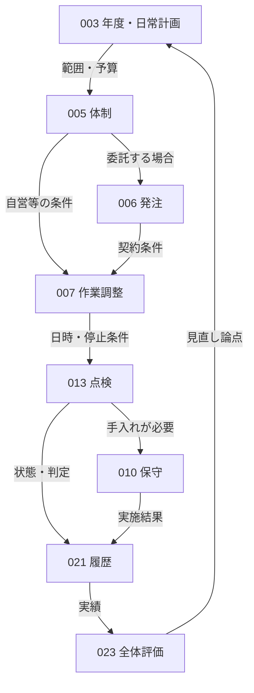
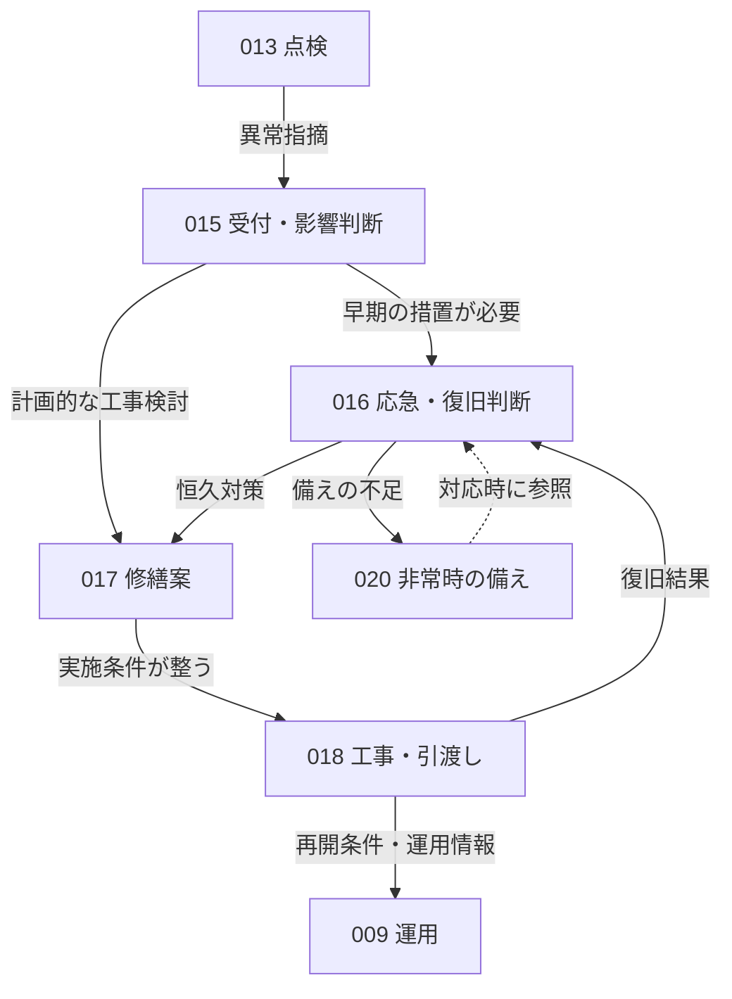
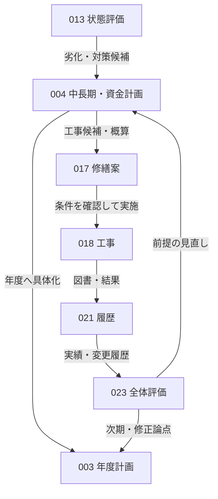

# 業務関係とライフサイクル

## 目的と正本

[PROCESS-001：業務カタログ](overview.md)の主要業務22件を、起動条件・成果物・判断によってつなぐ関係の索引。PROCESS-024は俯瞰文書用のIDであり、新たな個別業務ではない。

**関係の正本は各Processの「遷移条件と受渡し」**。既存の79件の方向を持つ前後関係について、送出側に条件・情報・判断・根拠と未確認事項を記載した。受入側の前工程から送出側へ辿れる。5組の「関連」は境界・情報の照合で、実行順序ではない。以下の図と表は代表関係の抜粋であり、変更時は送出側と相手側の索引を先に更新する。

法的要求、契約、事故・故障、利用方針変更は外部からProcessを起動し得る。すべての業務を一つの直線的な工程として実行する想定ではない。実施主体の役割は[BUSINESS-002](../00-business/actors.md)、目的は[BUSINESS-001](../00-business/overview.md)に従う。

## 共通パターンと適用限界

[JFMAの管理循環](https://www.jfma.or.jp/whatsFM/index.html)は計画・運営維持・評価等のつながりを示し、[官庁施設向け資料](https://www.cbr.mlit.go.jp/eizen/hozen/hozen_tantou.htm)は年度・中長期計画と履歴を扱う。これを手がかりに、本知識ベースでは「要求・計画→実施条件→実施・状態確認→記録・評価→要求・計画の見直し」を**共通の整理パターン**とする。参照日：2026-09-14。

これは全建物で実証された唯一のライフサイクルではない。官庁施設・マンション等の資料を主体横断で接続した分析であり、民間非住宅や専門用途の適合は未確認。FM全体、新築・売買・賃貸営業のライフサイクルを包含しない。

## 定常系：予定した実施と評価の繰返し

計画に沿う代表経路を示す。日常運転・清掃・衛生・警戒は図では省略しているが、作業調整から必要な実施業務へ接続し、結果を記録・評価へ返す。同一条件での繰返しは、毎回の新規契約・予算承認を意味しない。

図中の番号はPROCESS-IDの末尾。例えば013→010は状態に応じた分岐であり、すべての点検後に保守を実施する意味ではない。異常なしでも記録し、次回予定で点検等を繰り返す。承認済み範囲を超える変更は条件を再調整する。

## 異常・例外系：影響判断と応急・恒久対策

運転警報・利用者申告・点検指摘・警戒中の発見から、PROCESS-015が直接起動し得る。次図は点検からの代表例。

点線は事前情報の参照で、訓練の終了が異常対応を発生させるという意味ではない。工事完了、契約履行の確認、利用再開の判断は別。未解消の危険や制約を残したまま「完了」にまとめない。長期計画の確定を待つことを緊急対応の一律の先行条件にはしない。

## 中長期への還流：状態・実績と予算の接続

予算・概算は実施の制約条件として渡す。計画への掲載が発注・着工の承認を兼ねるとは扱わない。日々の結果は履歴・報告・全体評価を経て中長期計画へ還流するほか、重要な劣化は状態評価から計画へ直接渡せる。判断者、停止損失、価格精度、見直し周期は個別確認事項。

## 外部条件と繰返しの入口

| 外部条件 | 主な起動先 | 繰返し・分岐の扱い |
| --- | --- | --- |
| 法令・条例の適用変更、用途・設備変更 | [PROCESS-002：適用要求・利用条件の整理](requirements.md) | 義務の対象を確認し、必要な計画・体制・提出条件へ渡す。改正が自動で全作業を起動するわけではない |
| 利用予定・予算期・計画見直し | [PROCESS-003：年度・日常の保全計画の編成](annual-plan.md)、[PROCESS-004：中長期修繕・資金計画の作成と見直し](long-term-plan.md) | 次期編成と臨時の計画修正を区別する |
| 契約の開始・更新・範囲変更 | [PROCESS-005：実施体制・役割・資源の整備](delivery-team.md)、[PROCESS-006：委託範囲・仕様の整理と発注](commissioning.md) | 自営・委託と必要な契約判断を区別する |
| 合意した運転時刻・作業予定 | [PROCESS-009：設備運転・監視・設定調整](operation-monitoring.md)、[PROCESS-010：軽微な保守・手入れ](routine-care.md)、[PROCESS-011：建物内外の清掃・汚れの予防](cleaning.md)、[PROCESS-012：給排水の衛生維持・害虫防除](sanitary-maintenance.md)、[PROCESS-019：警戒・入退管理・危険予防](preventive-security.md) | 各業務の次回実施。条件変更がなければ全計画を毎回再作成しない |
| 点検・測定の時期、臨時確認の必要 | [PROCESS-013：建築・設備の点検と状態評価](inspection.md)、[PROCESS-014：環境・衛生の測定調査と評価](environment-measurement.md) | 日常・定期・臨時を区別。法定周期・資格は個別確認 |
| 警報・事故・故障・利用者申告 | [PROCESS-015：不具合・異常の受付と影響判断](incident-triage.md)、[PROCESS-016：応急対応・復旧の調整と再開確認](incident-restoration.md) | 影響・権限に応じて専門連絡や応急対応へ進む |
| 訓練時期・担当変更・災害後の見直し | [PROCESS-020：非常時の体制・対応計画と訓練](emergency-preparedness.md) | 計画と訓練を更新。実際の異常対応とは起動条件が異なる |
| 図書更新・担当交代・報告期限 | [PROCESS-021：台帳・図書・履歴の更新と引継ぎ](records-handover.md)、[PROCESS-022：報告・提出と未対応事項の追跡](reporting-followup.md) | 記録の更新、引継ぎ、提出、未対応追跡を区別する |
| 評価時期・重要事象の振返り | [PROCESS-023：保全実績の評価と計画への反映](maintenance-review.md) | 要求・計画・体制を見直す必要性を判断する |

## Domainをまたぐ主な判断点

| 接点 | 引き渡す情報 | 判断する役割と分岐 | 関係の正本 |
| --- | --- | --- | --- |
| 状態評価→異常対応・保守・修繕 | 所見・根拠・対応要否・未確認範囲 | 専門的評価と管理者等の影響判断。手入れ、計画工事、緊急対応へ分ける | [PROCESS-013](inspection.md#遷移条件と受渡し) |
| 衛生評価→運用・対策 | 測定条件・値・判定 | 専門担当者が調整・対策・追加調査の必要性を判断する | [PROCESS-014](environment-measurement.md#遷移条件と受渡し) |
| 計画→工事具体化 | 候補・概算・資金前提 | 費用負担者と技術者が案を具体化。計画掲載だけで着工しない | [PROCESS-004](long-term-plan.md#遷移条件と受渡し) |
| 作業調整→実施 | 停止・入室・日時・安全条件 | 作業責任者と管理者等が条件を確認。未調整なら再調整する | [PROCESS-007](work-coordination.md#遷移条件と受渡し) |
| 工事→履行確認・運用・再開判断 | 技術的確認結果・変更図書・残課題 | 契約上の受領と安全・利用再開を分けて確認する | [PROCESS-018](repair-execution.md#遷移条件と受渡し) |
| 履行確認→是正の調整 | 不一致・是正依頼 | 確認者と権限者が是正条件を調整する | [PROCESS-008](completion-check.md#遷移条件と受渡し) |
| 履歴・報告→計画・方針 | 状態・実績・費用・残課題 | 評価担当者と方針決定者が変更の必要性を確認する | [PROCESS-023](maintenance-review.md#遷移条件と受渡し) |

この表の役割は固定的な会社・部署の割当ではない。具体的な決裁・資格・停止・通報権限は、送出側の関係行に記載した未確認事項を建物ごとに解消する。

## 全22業務の関係情報への索引

図で省略した業務も、この表から前後関係・外部起点・反復条件を確認できる。

| 送出元 | 主領域 | 条件付きの受渡し先 |
| --- | --- | --- |
| [PROCESS-002：適用要求・利用条件の整理](requirements.md#遷移条件と受渡し) | DOMAIN-001 | [PROCESS-003：年度・日常の保全計画の編成](annual-plan.md)、[PROCESS-004：中長期修繕・資金計画の作成と見直し](long-term-plan.md)、[PROCESS-005：実施体制・役割・資源の整備](delivery-team.md)、[PROCESS-020：非常時の体制・対応計画と訓練](emergency-preparedness.md)、[PROCESS-022：報告・提出と未対応事項の追跡](reporting-followup.md)、[PROCESS-021：台帳・図書・履歴の更新と引継ぎ](records-handover.md) |
| [PROCESS-003：年度・日常の保全計画の編成](annual-plan.md#遷移条件と受渡し) | DOMAIN-002 | [PROCESS-005：実施体制・役割・資源の整備](delivery-team.md)、[PROCESS-021：台帳・図書・履歴の更新と引継ぎ](records-handover.md) |
| [PROCESS-004：中長期修繕・資金計画の作成と見直し](long-term-plan.md#遷移条件と受渡し) | DOMAIN-002 | [PROCESS-003：年度・日常の保全計画の編成](annual-plan.md)、[PROCESS-017：修繕・更新案の具体化](repair-design.md)、[PROCESS-021：台帳・図書・履歴の更新と引継ぎ](records-handover.md) |
| [PROCESS-005：実施体制・役割・資源の整備](delivery-team.md#遷移条件と受渡し) | DOMAIN-003 | [PROCESS-006：委託範囲・仕様の整理と発注](commissioning.md)、[PROCESS-007：作業条件・停止・利用者調整](work-coordination.md)、[PROCESS-021：台帳・図書・履歴の更新と引継ぎ](records-handover.md) |
| [PROCESS-006：委託範囲・仕様の整理と発注](commissioning.md#遷移条件と受渡し) | DOMAIN-003 | [PROCESS-007：作業条件・停止・利用者調整](work-coordination.md)、[PROCESS-021：台帳・図書・履歴の更新と引継ぎ](records-handover.md) |
| [PROCESS-007：作業条件・停止・利用者調整](work-coordination.md#遷移条件と受渡し) | DOMAIN-003 | [PROCESS-009：設備運転・監視・設定調整](operation-monitoring.md)、[PROCESS-010：軽微な保守・手入れ](routine-care.md)、[PROCESS-011：建物内外の清掃・汚れの予防](cleaning.md)、[PROCESS-012：給排水の衛生維持・害虫防除](sanitary-maintenance.md)、[PROCESS-013：建築・設備の点検と状態評価](inspection.md)、[PROCESS-014：環境・衛生の測定調査と評価](environment-measurement.md)、[PROCESS-018：修繕・更新の実施と技術的引渡し](repair-execution.md)、[PROCESS-019：警戒・入退管理・危険予防](preventive-security.md) |
| [PROCESS-008：依頼・契約に対する履行確認](completion-check.md#遷移条件と受渡し) | DOMAIN-003 | [PROCESS-022：報告・提出と未対応事項の追跡](reporting-followup.md)、[PROCESS-021：台帳・図書・履歴の更新と引継ぎ](records-handover.md)、[PROCESS-007：作業条件・停止・利用者調整](work-coordination.md) |
| [PROCESS-009：設備運転・監視・設定調整](operation-monitoring.md#遷移条件と受渡し) | DOMAIN-004 | [PROCESS-008：依頼・契約に対する履行確認](completion-check.md)、[PROCESS-013：建築・設備の点検と状態評価](inspection.md)、[PROCESS-015：不具合・異常の受付と影響判断](incident-triage.md)、[PROCESS-021：台帳・図書・履歴の更新と引継ぎ](records-handover.md) |
| [PROCESS-010：軽微な保守・手入れ](routine-care.md#遷移条件と受渡し) | DOMAIN-004 | [PROCESS-008：依頼・契約に対する履行確認](completion-check.md)、[PROCESS-021：台帳・図書・履歴の更新と引継ぎ](records-handover.md) |
| [PROCESS-011：建物内外の清掃・汚れの予防](cleaning.md#遷移条件と受渡し) | DOMAIN-004 | [PROCESS-008：依頼・契約に対する履行確認](completion-check.md)、[PROCESS-021：台帳・図書・履歴の更新と引継ぎ](records-handover.md) |
| [PROCESS-012：給排水の衛生維持・害虫防除](sanitary-maintenance.md#遷移条件と受渡し) | DOMAIN-004 | [PROCESS-008：依頼・契約に対する履行確認](completion-check.md)、[PROCESS-014：環境・衛生の測定調査と評価](environment-measurement.md)、[PROCESS-021：台帳・図書・履歴の更新と引継ぎ](records-handover.md) |
| [PROCESS-013：建築・設備の点検と状態評価](inspection.md#遷移条件と受渡し) | DOMAIN-005 | [PROCESS-008：依頼・契約に対する履行確認](completion-check.md)、[PROCESS-004：中長期修繕・資金計画の作成と見直し](long-term-plan.md)、[PROCESS-010：軽微な保守・手入れ](routine-care.md)、[PROCESS-015：不具合・異常の受付と影響判断](incident-triage.md)、[PROCESS-017：修繕・更新案の具体化](repair-design.md)、[PROCESS-021：台帳・図書・履歴の更新と引継ぎ](records-handover.md) |
| [PROCESS-014：環境・衛生の測定調査と評価](environment-measurement.md#遷移条件と受渡し) | DOMAIN-005 | [PROCESS-008：依頼・契約に対する履行確認](completion-check.md)、[PROCESS-009：設備運転・監視・設定調整](operation-monitoring.md)、[PROCESS-012：給排水の衛生維持・害虫防除](sanitary-maintenance.md)、[PROCESS-015：不具合・異常の受付と影響判断](incident-triage.md)、[PROCESS-021：台帳・図書・履歴の更新と引継ぎ](records-handover.md) |
| [PROCESS-015：不具合・異常の受付と影響判断](incident-triage.md#遷移条件と受渡し) | DOMAIN-006 | [PROCESS-016：応急対応・復旧の調整と再開確認](incident-restoration.md)、[PROCESS-017：修繕・更新案の具体化](repair-design.md)、[PROCESS-021：台帳・図書・履歴の更新と引継ぎ](records-handover.md) |
| [PROCESS-016：応急対応・復旧の調整と再開確認](incident-restoration.md#遷移条件と受渡し) | DOMAIN-006 | [PROCESS-017：修繕・更新案の具体化](repair-design.md)、[PROCESS-020：非常時の体制・対応計画と訓練](emergency-preparedness.md)、[PROCESS-021：台帳・図書・履歴の更新と引継ぎ](records-handover.md) |
| [PROCESS-017：修繕・更新案の具体化](repair-design.md#遷移条件と受渡し) | DOMAIN-007 | [PROCESS-006：委託範囲・仕様の整理と発注](commissioning.md)、[PROCESS-018：修繕・更新の実施と技術的引渡し](repair-execution.md)、[PROCESS-021：台帳・図書・履歴の更新と引継ぎ](records-handover.md) |
| [PROCESS-018：修繕・更新の実施と技術的引渡し](repair-execution.md#遷移条件と受渡し) | DOMAIN-007 | [PROCESS-008：依頼・契約に対する履行確認](completion-check.md)、[PROCESS-009：設備運転・監視・設定調整](operation-monitoring.md)、[PROCESS-013：建築・設備の点検と状態評価](inspection.md)、[PROCESS-016：応急対応・復旧の調整と再開確認](incident-restoration.md)、[PROCESS-021：台帳・図書・履歴の更新と引継ぎ](records-handover.md) |
| [PROCESS-019：警戒・入退管理・危険予防](preventive-security.md#遷移条件と受渡し) | DOMAIN-008 | [PROCESS-008：依頼・契約に対する履行確認](completion-check.md)、[PROCESS-015：不具合・異常の受付と影響判断](incident-triage.md)、[PROCESS-021：台帳・図書・履歴の更新と引継ぎ](records-handover.md) |
| [PROCESS-020：非常時の体制・対応計画と訓練](emergency-preparedness.md#遷移条件と受渡し) | DOMAIN-008 | [PROCESS-016：応急対応・復旧の調整と再開確認](incident-restoration.md)、[PROCESS-021：台帳・図書・履歴の更新と引継ぎ](records-handover.md) |
| [PROCESS-021：台帳・図書・履歴の更新と引継ぎ](records-handover.md#遷移条件と受渡し) | DOMAIN-009 | [PROCESS-022：報告・提出と未対応事項の追跡](reporting-followup.md)、[PROCESS-023：保全実績の評価と計画への反映](maintenance-review.md) |
| [PROCESS-022：報告・提出と未対応事項の追跡](reporting-followup.md#遷移条件と受渡し) | DOMAIN-009 | [PROCESS-021：台帳・図書・履歴の更新と引継ぎ](records-handover.md)、[PROCESS-023：保全実績の評価と計画への反映](maintenance-review.md)、[PROCESS-015：不具合・異常の受付と影響判断](incident-triage.md)、[PROCESS-017：修繕・更新案の具体化](repair-design.md) |
| [PROCESS-023：保全実績の評価と計画への反映](maintenance-review.md#遷移条件と受渡し) | DOMAIN-009 | [PROCESS-002：適用要求・利用条件の整理](requirements.md)、[PROCESS-003：年度・日常の保全計画の編成](annual-plan.md)、[PROCESS-004：中長期修繕・資金計画の作成と見直し](long-term-plan.md)、[PROCESS-005：実施体制・役割・資源の整備](delivery-team.md)、[PROCESS-021：台帳・図書・履歴の更新と引継ぎ](records-handover.md) |

## 情報源と判断の限界

- [FMとは／JFMA](https://www.jfma.or.jp/whatsFM/index.html)：管理循環の公開説明を2026-09-14に確認。参照箇所はFMの標準業務・サイクル。全建物の工程順序の根拠にはしない。
- [建築保全業務共通仕様書 令和5年版／国土交通省](https://www.mlit.go.jp/gobuild/content/001707660.pdf)：第1編1.1.2、1.1.7、1.2、1.3を2026-09-14に確認。2023-11-08改定掲載版。非常時の備え、実施条件、記録等を接続する手がかりとした。官庁施設向け委託仕様を、民間の一律の承認経路・義務と扱わない。
- [保全担当者の皆様へ／国土交通省中部地方整備局](https://www.cbr.mlit.go.jp/eizen/hozen/hozen_tantou.htm)：保全計画・台帳の説明を2026-09-14に確認。日常実績と年度・中長期の時間軸をつなぐ手がかり。個別制度の役職・様式を共通化しない。
- [PROCESS-001の情報源](overview.md#情報源)：Issue4の各業務を支える資料と適用限界。各受渡し行では送出元・受入先それぞれの情報源へリンクした。既存の資料参照日はそのまま維持した。

79件の関係は根拠資料を組み合わせた分析であり、現場で動作確認した経路ではない。各行に、具体権限・条件・期限等の未確認点を付けることで、その分析を制度上・現場上の事実と区別する。

## 未確認事項

- 業務を起動する閾値・期限、停止・再開・発注・予算変更の権限。各送出文書の関係行を起点に確認する。
- 法定提出・点検等の対象、周期、義務者。要求整理の結果なしに一律に適用しない。
- 仮復旧後の恒久対策、報告後の未対応、是正後の再確認をどの役割が継続追跡するか。
- 自営・委託、常駐・巡回、複数所有等で経路の省略・兼務・追加がどう変わるか。
- 技術的引渡し、衛生対策、非常時の備えなどexploringの業務の境界。経路を記載しても業務の確定状態は引き上げない。
- 詳細な例外・作業手順と現場Evidenceによる検証は後続Issueで扱う。図の網羅性や単一の承認フローを主張しない。
