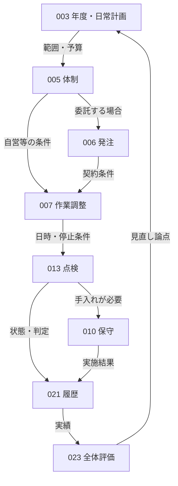
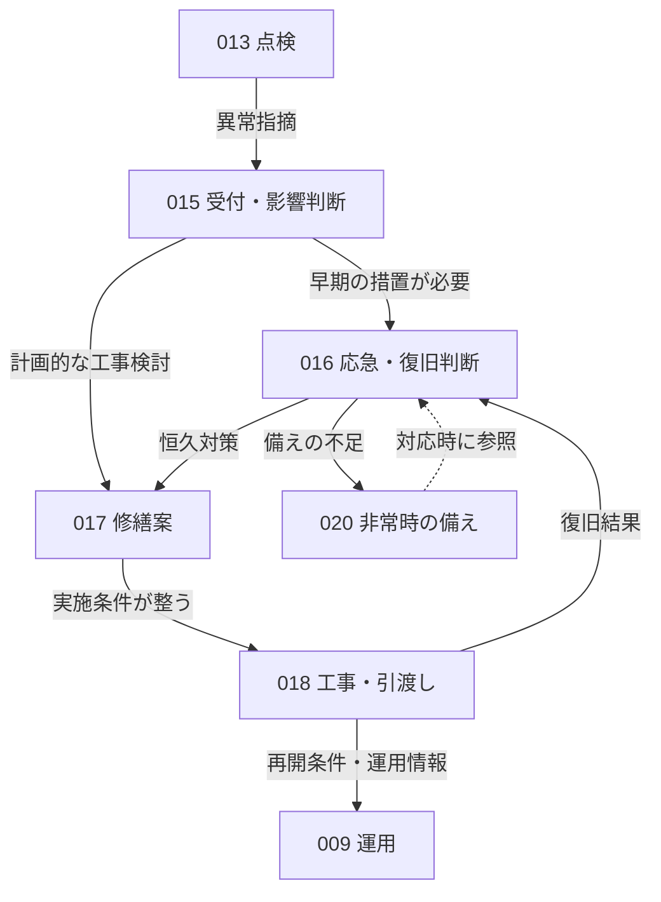
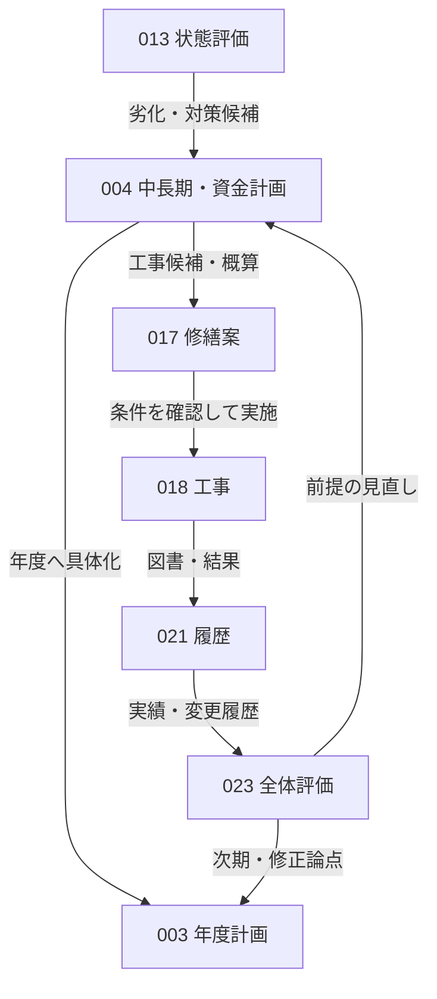

# 業務のつながり

建物の管理では、点検の結果を修繕へ渡したり、修繕の記録を次の計画に使ったりします。ここでは、代表的なつながりを3つの図で示します。

- 予定した作業を行い、結果を確認する。
- 異常に対応し、再発を防ぐ。
- 点検・作業の結果を将来の計画に生かす。

すべての仕事を順番に行うわけではありません。異常の連絡や利用条件の変更から始まる仕事もあります。各業務へ渡す詳しい情報と条件は、下の「個別業務から引継ぎ先を探す」から確認できます。

## 共通パターンと適用限界

[JFMAの管理循環](https://www.jfma.or.jp/whatsFM/index.html)は計画・運営維持・評価等のつながりを示し、[官庁施設向け資料](https://www.cbr.mlit.go.jp/eizen/hozen/hozen_tantou.htm)は年度・中長期計画と履歴を扱う。これを手がかりに、本知識ベースでは「要求・計画→実施条件→実施・状態確認→記録・評価→要求・計画の見直し」を**共通の整理パターン**とする。参照日：2026-09-14。

これは全建物で実証された唯一のライフサイクルではない。官庁施設・マンション等の資料を所有者・管理者・作業者などの立場をまたいで接続した分析であり、民間非住宅や専門用途の適合は未確認。FM全体、新築・売買・賃貸営業のライフサイクルを包含しない。

## 予定した作業を行い、結果を確認する

計画に沿う代表経路を示す。日常運転・清掃・衛生・警戒は図では省略しているが、作業調整から必要な実施業務へ接続し、結果を記録・評価へ返す。同一条件での繰返しは、毎回の新規契約・予算承認を意味しない。

図中の番号はPROCESS-IDの末尾。例えば013→010は状態に応じた分岐であり、すべての点検後に保守を実施する意味ではない。異常なしでも記録し、次回予定で点検等を繰り返す。承認済み範囲を超える変更は条件を再調整する。

## 異常に対応し、再発を防ぐ

運転警報・利用者申告・点検指摘・警戒中の発見から、PROCESS-015が直接始まることがある。次図は点検からの代表例。

点線は事前情報の参照で、訓練の終了が異常対応を発生させるという意味ではない。工事完了、契約履行の確認、利用再開の判断は別。未解消の危険や制約を残したまま「完了」にまとめない。長期計画の確定を待つことを緊急対応の一律の先行条件にはしない。

## 点検・作業の結果を将来の計画に生かす

予算・概算は実施の制約条件として渡す。計画への掲載が発注・着工の承認を兼ねるとは扱わない。日々の結果は履歴・報告・全体評価を経て中長期計画へ反映するほか、重要な劣化は状態評価から計画へ直接渡せる。判断者、停止損失、価格精度、見直し周期は個別確認事項。

## 外部条件と繰返しの入口

| 外部条件 | 主な起動先 | 繰返し・分岐の扱い |
| --- | --- | --- |
| 法令・条例の適用変更、用途・設備変更 | [PROCESS-002：守るルールと利用条件を確認する](requirements.md) | 義務の対象を確認し、必要な計画・体制・提出条件へ渡す。改正が自動で全作業を起動するわけではない |
| 利用予定・予算期・計画見直し | [PROCESS-003：年度・日常の作業計画を立てる](annual-plan.md)、[PROCESS-004：将来の修繕と費用を計画する](long-term-plan.md) | 次期編成と臨時の計画修正を区別する |
| 契約の開始・更新・範囲変更 | [PROCESS-005：担当者・役割・必要な人員を決める](delivery-team.md)、[PROCESS-006：依頼する作業を決めて発注する](commissioning.md) | 自営・委託と必要な契約判断を区別する |
| 合意した運転時刻・作業予定 | [PROCESS-009：設備を運転・監視し、設定を調整する](operation-monitoring.md)、[PROCESS-010：消耗品の交換・手入れをする](routine-care.md)、[PROCESS-011：建物を清掃し、汚れを防ぐ](cleaning.md)、[PROCESS-012：水まわりを衛生的に保ち、害虫を防ぐ](sanitary-maintenance.md)、[PROCESS-019：巡回・入退館の確認で危険を防ぐ](preventive-security.md) | 各業務の次回実施。条件変更がなければ全計画を毎回再作成しない |
| 点検・測定の時期、臨時確認の必要 | [PROCESS-013：建物・設備を点検し、状態を判断する](inspection.md)、[PROCESS-014：空気・水などを測定し、衛生状態を確認する](environment-measurement.md) | 日常・定期・臨時を区別。法定周期・資格は個別確認 |
| 警報・事故・故障・利用者申告 | [PROCESS-015：異常の連絡を受け、影響を判断する](incident-triage.md)、[PROCESS-016：応急対応・復旧を進め、利用再開を確認する](incident-restoration.md) | 影響・権限に応じて専門連絡や応急対応へ進む |
| 訓練時期・担当変更・災害後の見直し | [PROCESS-020：非常時の連絡・対応を決めて訓練する](emergency-preparedness.md) | 計画と訓練を更新。実際の異常対応とは開始のきっかけが異なる |
| 図書更新・担当交代・報告期限 | [PROCESS-021：台帳・図面・作業記録を更新し、引き継ぐ](records-handover.md)、[PROCESS-022：結果を報告し、未対応のものを確認する](reporting-followup.md) | 記録の更新、引継ぎ、提出、未対応追跡を区別する |
| 評価時期・重要事象の振返り | [PROCESS-023：作業の結果を振り返り、計画を見直す](maintenance-review.md) | 要求・計画・体制を見直す必要性を判断する |

## 業務分類をまたぐ判断

| 接点 | 引き渡す情報 | 判断する役割と分岐 | 詳しい説明 |
| --- | --- | --- | --- |
| 状態評価→異常対応・保守・修繕 | 所見・根拠・対応要否・未確認範囲 | 専門的評価と管理者等の影響判断。手入れ、計画工事、緊急対応へ分ける | [建物・設備を点検し、状態を判断する（PROCESS-013）](inspection.md#次の業務へ渡す情報と条件) |
| 衛生評価→運用・対策 | 測定条件・値・判定 | 専門担当者が調整・対策・追加調査の必要性を判断する | [空気・水などを測定し、衛生状態を確認する（PROCESS-014）](environment-measurement.md#次の業務へ渡す情報と条件) |
| 計画→工事具体化 | 候補・概算・資金前提 | 費用負担者と技術者が案を具体化。計画掲載だけで着工しない | [将来の修繕と費用を計画する（PROCESS-004）](long-term-plan.md#次の業務へ渡す情報と条件) |
| 作業調整→実施 | 停止・入室・日時・安全条件 | 作業責任者と管理者等が条件を確認。未調整なら再調整する | [作業日時・設備停止・利用者への連絡を調整する（PROCESS-007）](work-coordination.md#次の業務へ渡す情報と条件) |
| 工事→契約どおりの作業かの確認・運用・再開判断 | 技術的確認結果・変更図書・残課題 | 契約上の受領と安全・利用再開を分けて確認する | [修繕・交換工事を行い、仕上がりを確認する（PROCESS-018）](repair-execution.md#次の業務へ渡す情報と条件) |
| 契約どおりの作業かの確認→是正の調整 | 不一致・是正依頼 | 確認者と権限者が是正条件を調整する | [契約どおりに作業されたか確認する（PROCESS-008）](completion-check.md#次の業務へ渡す情報と条件) |
| 履歴・報告→計画・方針 | 状態・実績・費用・残課題 | 評価担当者と方針決定者が変更の必要性を確認する | [作業の結果を振り返り、計画を見直す（PROCESS-023）](maintenance-review.md#次の業務へ渡す情報と条件) |

会社や部署による固定の分担ではありません。決裁・資格・停止・通報の権限は、各業務に記載した未確認事項を建物ごとに確かめます。SaaSで引継ぎを支援する際も、連絡する人と判断する人の違いを確認します。

## 個別業務から引継ぎ先を探す

図で省略した業務も、この表から前後関係・外部起点・反復条件を確認できる。

| 引き継ぐ業務 | 業務の分類 | 条件に応じた引継ぎ先 |
| --- | --- | --- |
| [PROCESS-002：守るルールと利用条件を確認する](requirements.md#次の業務へ渡す情報と条件) | [守るルール・利用条件（DOMAIN-001）](../01-domains/requirements.md) | [PROCESS-003：年度・日常の作業計画を立てる](annual-plan.md)、[PROCESS-004：将来の修繕と費用を計画する](long-term-plan.md)、[PROCESS-005：担当者・役割・必要な人員を決める](delivery-team.md)、[PROCESS-020：非常時の連絡・対応を決めて訓練する](emergency-preparedness.md)、[PROCESS-022：結果を報告し、未対応のものを確認する](reporting-followup.md)、[PROCESS-021：台帳・図面・作業記録を更新し、引き継ぐ](records-handover.md) |
| [PROCESS-003：年度・日常の作業計画を立てる](annual-plan.md#次の業務へ渡す情報と条件) | [作業・修繕・費用の計画（DOMAIN-002）](../01-domains/planning.md) | [PROCESS-005：担当者・役割・必要な人員を決める](delivery-team.md)、[PROCESS-021：台帳・図面・作業記録を更新し、引き継ぐ](records-handover.md) |
| [PROCESS-004：将来の修繕と費用を計画する](long-term-plan.md#次の業務へ渡す情報と条件) | [作業・修繕・費用の計画（DOMAIN-002）](../01-domains/planning.md) | [PROCESS-003：年度・日常の作業計画を立てる](annual-plan.md)、[PROCESS-017：修繕・交換の方法と範囲を決める](repair-design.md)、[PROCESS-021：台帳・図面・作業記録を更新し、引き継ぐ](records-handover.md) |
| [PROCESS-005：担当者・役割・必要な人員を決める](delivery-team.md#次の業務へ渡す情報と条件) | [担当・発注・作業の調整（DOMAIN-003）](../01-domains/delivery-coordination.md) | [PROCESS-006：依頼する作業を決めて発注する](commissioning.md)、[PROCESS-007：作業日時・設備停止・利用者への連絡を調整する](work-coordination.md)、[PROCESS-021：台帳・図面・作業記録を更新し、引き継ぐ](records-handover.md) |
| [PROCESS-006：依頼する作業を決めて発注する](commissioning.md#次の業務へ渡す情報と条件) | [担当・発注・作業の調整（DOMAIN-003）](../01-domains/delivery-coordination.md) | [PROCESS-007：作業日時・設備停止・利用者への連絡を調整する](work-coordination.md)、[PROCESS-021：台帳・図面・作業記録を更新し、引き継ぐ](records-handover.md) |
| [PROCESS-007：作業日時・設備停止・利用者への連絡を調整する](work-coordination.md#次の業務へ渡す情報と条件) | [担当・発注・作業の調整（DOMAIN-003）](../01-domains/delivery-coordination.md) | [PROCESS-009：設備を運転・監視し、設定を調整する](operation-monitoring.md)、[PROCESS-010：消耗品の交換・手入れをする](routine-care.md)、[PROCESS-011：建物を清掃し、汚れを防ぐ](cleaning.md)、[PROCESS-012：水まわりを衛生的に保ち、害虫を防ぐ](sanitary-maintenance.md)、[PROCESS-013：建物・設備を点検し、状態を判断する](inspection.md)、[PROCESS-014：空気・水などを測定し、衛生状態を確認する](environment-measurement.md)、[PROCESS-018：修繕・交換工事を行い、仕上がりを確認する](repair-execution.md)、[PROCESS-019：巡回・入退館の確認で危険を防ぐ](preventive-security.md) |
| [PROCESS-008：契約どおりに作業されたか確認する](completion-check.md#次の業務へ渡す情報と条件) | [担当・発注・作業の調整（DOMAIN-003）](../01-domains/delivery-coordination.md) | [PROCESS-022：結果を報告し、未対応のものを確認する](reporting-followup.md)、[PROCESS-021：台帳・図面・作業記録を更新し、引き継ぐ](records-handover.md)、[PROCESS-007：作業日時・設備停止・利用者への連絡を調整する](work-coordination.md) |
| [PROCESS-009：設備を運転・監視し、設定を調整する](operation-monitoring.md#次の業務へ渡す情報と条件) | [日々の運転・手入れ・清掃（DOMAIN-004）](../01-domains/operations.md) | [PROCESS-008：契約どおりに作業されたか確認する](completion-check.md)、[PROCESS-013：建物・設備を点検し、状態を判断する](inspection.md)、[PROCESS-015：異常の連絡を受け、影響を判断する](incident-triage.md)、[PROCESS-021：台帳・図面・作業記録を更新し、引き継ぐ](records-handover.md) |
| [PROCESS-010：消耗品の交換・手入れをする](routine-care.md#次の業務へ渡す情報と条件) | [日々の運転・手入れ・清掃（DOMAIN-004）](../01-domains/operations.md) | [PROCESS-008：契約どおりに作業されたか確認する](completion-check.md)、[PROCESS-021：台帳・図面・作業記録を更新し、引き継ぐ](records-handover.md) |
| [PROCESS-011：建物を清掃し、汚れを防ぐ](cleaning.md#次の業務へ渡す情報と条件) | [日々の運転・手入れ・清掃（DOMAIN-004）](../01-domains/operations.md) | [PROCESS-008：契約どおりに作業されたか確認する](completion-check.md)、[PROCESS-021：台帳・図面・作業記録を更新し、引き継ぐ](records-handover.md) |
| [PROCESS-012：水まわりを衛生的に保ち、害虫を防ぐ](sanitary-maintenance.md#次の業務へ渡す情報と条件) | [日々の運転・手入れ・清掃（DOMAIN-004）](../01-domains/operations.md) | [PROCESS-008：契約どおりに作業されたか確認する](completion-check.md)、[PROCESS-014：空気・水などを測定し、衛生状態を確認する](environment-measurement.md)、[PROCESS-021：台帳・図面・作業記録を更新し、引き継ぐ](records-handover.md) |
| [PROCESS-013：建物・設備を点検し、状態を判断する](inspection.md#次の業務へ渡す情報と条件) | [点検・測定（DOMAIN-005）](../01-domains/inspection-assessment.md) | [PROCESS-008：契約どおりに作業されたか確認する](completion-check.md)、[PROCESS-004：将来の修繕と費用を計画する](long-term-plan.md)、[PROCESS-010：消耗品の交換・手入れをする](routine-care.md)、[PROCESS-015：異常の連絡を受け、影響を判断する](incident-triage.md)、[PROCESS-017：修繕・交換の方法と範囲を決める](repair-design.md)、[PROCESS-021：台帳・図面・作業記録を更新し、引き継ぐ](records-handover.md) |
| [PROCESS-014：空気・水などを測定し、衛生状態を確認する](environment-measurement.md#次の業務へ渡す情報と条件) | [点検・測定（DOMAIN-005）](../01-domains/inspection-assessment.md) | [PROCESS-008：契約どおりに作業されたか確認する](completion-check.md)、[PROCESS-009：設備を運転・監視し、設定を調整する](operation-monitoring.md)、[PROCESS-012：水まわりを衛生的に保ち、害虫を防ぐ](sanitary-maintenance.md)、[PROCESS-015：異常の連絡を受け、影響を判断する](incident-triage.md)、[PROCESS-021：台帳・図面・作業記録を更新し、引き継ぐ](records-handover.md) |
| [PROCESS-015：異常の連絡を受け、影響を判断する](incident-triage.md#次の業務へ渡す情報と条件) | [異常・故障への対応（DOMAIN-006）](../01-domains/incident-response.md) | [PROCESS-016：応急対応・復旧を進め、利用再開を確認する](incident-restoration.md)、[PROCESS-017：修繕・交換の方法と範囲を決める](repair-design.md)、[PROCESS-021：台帳・図面・作業記録を更新し、引き継ぐ](records-handover.md) |
| [PROCESS-016：応急対応・復旧を進め、利用再開を確認する](incident-restoration.md#次の業務へ渡す情報と条件) | [異常・故障への対応（DOMAIN-006）](../01-domains/incident-response.md) | [PROCESS-017：修繕・交換の方法と範囲を決める](repair-design.md)、[PROCESS-020：非常時の連絡・対応を決めて訓練する](emergency-preparedness.md)、[PROCESS-021：台帳・図面・作業記録を更新し、引き継ぐ](records-handover.md) |
| [PROCESS-017：修繕・交換の方法と範囲を決める](repair-design.md#次の業務へ渡す情報と条件) | [修繕・更新（DOMAIN-007）](../01-domains/repair-renewal.md) | [PROCESS-006：依頼する作業を決めて発注する](commissioning.md)、[PROCESS-018：修繕・交換工事を行い、仕上がりを確認する](repair-execution.md)、[PROCESS-021：台帳・図面・作業記録を更新し、引き継ぐ](records-handover.md) |
| [PROCESS-018：修繕・交換工事を行い、仕上がりを確認する](repair-execution.md#次の業務へ渡す情報と条件) | [修繕・更新（DOMAIN-007）](../01-domains/repair-renewal.md) | [PROCESS-008：契約どおりに作業されたか確認する](completion-check.md)、[PROCESS-009：設備を運転・監視し、設定を調整する](operation-monitoring.md)、[PROCESS-013：建物・設備を点検し、状態を判断する](inspection.md)、[PROCESS-016：応急対応・復旧を進め、利用再開を確認する](incident-restoration.md)、[PROCESS-021：台帳・図面・作業記録を更新し、引き継ぐ](records-handover.md) |
| [PROCESS-019：巡回・入退館の確認で危険を防ぐ](preventive-security.md#次の業務へ渡す情報と条件) | [事故の予防・災害への備え（DOMAIN-008）](../01-domains/risk-preparedness.md) | [PROCESS-008：契約どおりに作業されたか確認する](completion-check.md)、[PROCESS-015：異常の連絡を受け、影響を判断する](incident-triage.md)、[PROCESS-021：台帳・図面・作業記録を更新し、引き継ぐ](records-handover.md) |
| [PROCESS-020：非常時の連絡・対応を決めて訓練する](emergency-preparedness.md#次の業務へ渡す情報と条件) | [事故の予防・災害への備え（DOMAIN-008）](../01-domains/risk-preparedness.md) | [PROCESS-016：応急対応・復旧を進め、利用再開を確認する](incident-restoration.md)、[PROCESS-021：台帳・図面・作業記録を更新し、引き継ぐ](records-handover.md) |
| [PROCESS-021：台帳・図面・作業記録を更新し、引き継ぐ](records-handover.md#次の業務へ渡す情報と条件) | [記録・報告・改善（DOMAIN-009）](../01-domains/records-evaluation.md) | [PROCESS-022：結果を報告し、未対応のものを確認する](reporting-followup.md)、[PROCESS-023：作業の結果を振り返り、計画を見直す](maintenance-review.md) |
| [PROCESS-022：結果を報告し、未対応のものを確認する](reporting-followup.md#次の業務へ渡す情報と条件) | [記録・報告・改善（DOMAIN-009）](../01-domains/records-evaluation.md) | [PROCESS-021：台帳・図面・作業記録を更新し、引き継ぐ](records-handover.md)、[PROCESS-023：作業の結果を振り返り、計画を見直す](maintenance-review.md)、[PROCESS-015：異常の連絡を受け、影響を判断する](incident-triage.md)、[PROCESS-017：修繕・交換の方法と範囲を決める](repair-design.md) |
| [PROCESS-023：作業の結果を振り返り、計画を見直す](maintenance-review.md#次の業務へ渡す情報と条件) | [記録・報告・改善（DOMAIN-009）](../01-domains/records-evaluation.md) | [PROCESS-002：守るルールと利用条件を確認する](requirements.md)、[PROCESS-003：年度・日常の作業計画を立てる](annual-plan.md)、[PROCESS-004：将来の修繕と費用を計画する](long-term-plan.md)、[PROCESS-005：担当者・役割・必要な人員を決める](delivery-team.md)、[PROCESS-021：台帳・図面・作業記録を更新し、引き継ぐ](records-handover.md) |

## 情報源と判断の限界

- [FMとは／JFMA](https://www.jfma.or.jp/whatsFM/index.html)：管理循環の公開説明を2026-09-14に確認。参照箇所はFMの標準業務・サイクル。全建物の工程順序の根拠にはしない。
- [建築保全業務共通仕様書 令和5年版／国土交通省](https://www.mlit.go.jp/gobuild/content/001707660.pdf)：第1編1.1.2、1.1.7、1.2、1.3を2026-09-14に確認。2023-11-08改定掲載版。非常時の備え、実施条件、記録等を接続する手がかりとした。官庁施設向け委託仕様を、民間の一律の承認経路・義務と扱わない。
- [保全担当者の皆様へ／国土交通省中部地方整備局](https://www.cbr.mlit.go.jp/eizen/hozen/hozen_tantou.htm)：保全計画・台帳の説明を2026-09-14に確認。日常実績と年度・中長期の時間軸をつなぐ手がかり。個別制度の役職・様式を共通化しない。
- [PROCESS-001の情報源](overview.md#情報源)：個別の各業務を支える資料と適用限界。業務間の引継ぎは、渡す側と受け取る側の資料を組み合わせた整理です。

79件の関係は根拠資料を組み合わせた分析であり、現場で動作確認した経路ではない。各行に、具体権限・条件・期限等の未確認点を付けることで、その分析を制度上・現場上の事実と区別する。

## 未確認事項

- 業務を起動する閾値・期限、停止・再開・発注・予算変更の権限。各送出文書の関係行を起点に確認する。
- 法定提出・点検等の対象、周期、義務者。要求整理の結果なしに一律に適用しない。
- 仮復旧後の恒久対策、報告後の未対応、是正後の再確認をどの役割が継続追跡するか。
- 自営・委託、常駐・巡回、複数所有等で経路の省略・兼務・追加がどう変わるか。
- 工事の技術的な引渡し、衛生対策、非常時の備えについて、対象ごとの手順・役割・成果の違い。業務のつながりを示した図だけでは、個別の手順は確定しません。
- 詳細な例外・作業手順と現場の記録による検証は追加調査で扱う。図の網羅性や単一の承認フローを主張しない。

## 個別の手順を読む

[作業の調整（PROCESS-007）](work-coordination.md#標準フロー)、[点検（PROCESS-013）](inspection.md#標準フロー)、[契約どおりの作業かの確認（PROCESS-008）](completion-check.md#標準フロー)を参照してください。

## 異常対応・計画の手順を読む

[異常の受付（PROCESS-015）](incident-triage.md#標準フロー)、[応急対応・復旧（PROCESS-016）](incident-restoration.md#標準フロー)、[年度計画（PROCESS-003）](annual-plan.md#標準フロー)、[将来の修繕計画（PROCESS-004）](long-term-plan.md#標準フロー)を参照してください。
